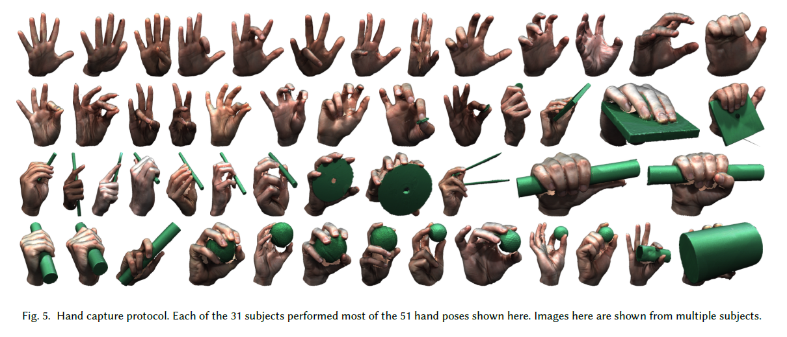
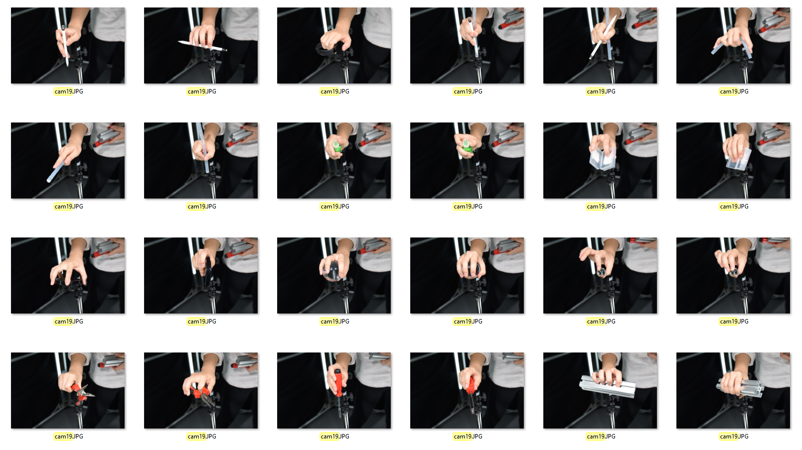

- [Others](#Others)
- [Time](#time)
- [MRI friendly](#mri-friendly)
- [First 50](#first-50)
  - [REST POSE](#rest-pose)
  - [ASL](#asl)
  - [ASL NUMBER](#asl-number)
  - [PINCH](#pinch)
  - [TEASER 10](#teaser-10)
- [Rest](#rest)
  - [BSL [26]](#bsl-26)
  - [BSL NUMBER [10]](#bsl-number-10)
  - [RECOVER [20]](#recover-20)
  - [ARTICUALTION [80]](#articualtion-80)
  - [OBJECT [25]](#object-25)

# Others

## MANO
31 * 51 


**区别：有inner modeling**

## SIGGRAPH-MRI-HAND
2 * 12

贴图来自于60个view的DLSR image


**区别：有muscle和tendon，nerve的建模，有拿物体的动作**

# Time
```py
len(poselist) = 50
pose_per_person = 9 #  (8 + 1) = 8 new pose plus one rest pose
len(person) = 7

for i in range(len(person)):
  for poselist[i:i+8]:
      MVS rest pose: 1 s
      倒模 = 5 min
      拍摄一个高清(0.3*0.3*1, t1/qsm) = 15 min 
      # 拍摄一个低清(0.3*0.3*2, t1) = 15 min
      # 拍摄一个低清(0.3*0.3*2, qsm) = 7 min
      # 拍摄一个高清小臂 = 15 min
  time_per_person = 20 * 9 = 180 min = 3 h
```

# MRI Friendly


# First 50

***五指张开，先分别拍左右手，手腕放在架子上，保证中指朝前。
所有动作**手掌方向**朝下，保持不变***

## REST POSE


## ASL


## ASL NUMBER


## PINCH


## TEASER 10


# Rest

## BSL [26]


## BSL NUMBER [10]


## RECOVER [20]


## ARTICUALTION [80]

----------------0-20

----------------20-40

----------------40-60

----------------60-80

## OBJECT [25]



