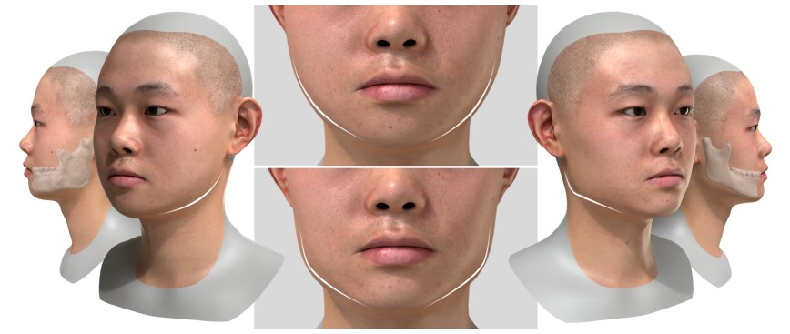
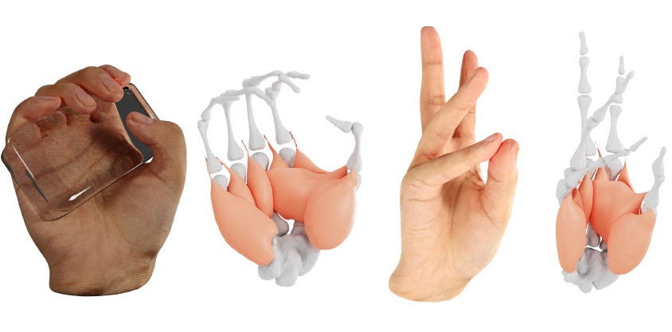
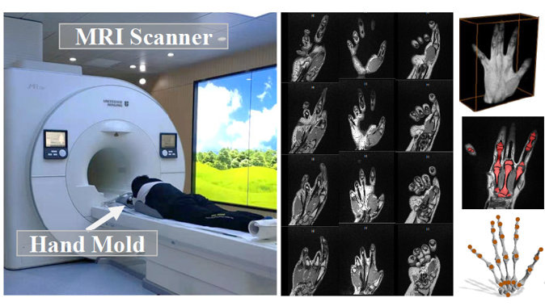
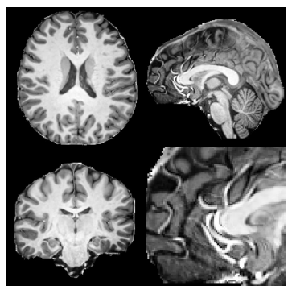
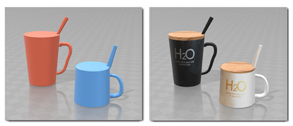
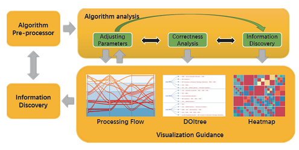
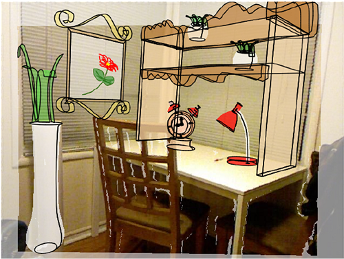

<!-- ## Yuwei Li -->

<!--  -->

### Yuwei Li (李玉玮)

Yuwei Li currently resides in the ever sunny [Bay Area](https://reyli.myportfolio.com/), where she works as a Graphics Researcher at HoYoVerse, focusing on 3D animation and video generation to empower next-generation AI-native games. Prior to relocating, she spent a year as a full-time researcher at miHoYo in Shanghai, where she collaborated with the mocap team to develop hand-tracking algorithms. 

Yuwei obtained her Ph.D. degree from ShanghaiTech University, Shanghai, advised by [Jingyi Yu](https://scholar.google.com/citations?hl=en&user=R9L_AfQAAAAJ) at [VDI](https://vic.shanghaitech.edu.cn), where her research focused on parametric hand modeling and high-quality human reconstruction. Before her doctoral studies, she spent two years conducting interactive graphics research with [Youyi Zheng](https://scholar.google.com/citations?zh-CN&user=Nc5xuioAAAAJ). She obtained her BE in Computer Science from Shanghai University, China.

## Contact

[Email](yuweirey@gmail.com) | [Github](https://github.com/reyuwei) | [LinkedIn](https://www.linkedin.com/in/yuwei17)  | [Scholar](https://scholar.google.com/citations?user=VennPcAAAAAJ&hl=en&oi=ao)

---

## Industry Projects

<table>
  <tr>
    <td width="20%">
      
    </td>
    <td width="80%">
      <b>LPM 1.0 (Large Performance Model)</b>
       
          A Diffusion Transformer for real-time, identity-consistent, and infinite-length conversational character performance. Contributed to the scalable multi-modal data pipeline and high-fidelity automated captioning workflows to scale high-quality training datasets for nuanced human-like generation.
       
      <i>Anuttacon, 2026</i>              
          [<a href="https://arxiv.org/pdf/2604.07823">tech report</a> | <a href="https://large-performance-model.github.io/">project</a>]

    </td>
  </tr>
  <tr>
    <td width="20%">
      
    </td>
    <td width="80%">
      <b>Whispers from the Star</b>
       
      The first AI-native story game featuring voice-controlled, open-ended real-time AI dialogue and emotionally rich humanoid animations. Contributed to the voice-driven generative facial animation system to enable immersive AI-driven storytelling.
       
      <i>Anuttacon, 2025</i>
                        [<a href="https://store.steampowered.com/app/3730100/Whispers_from_the_Star/">steam</a> | <a href="https://www.youtube.com/watch?v=N0HsjXQe0v0">behind the scene</a>]

    </td>
  </tr>
</table>

## Publications

<table>
      <tr>
        <td width="20%" height="100%">
            
        </td>
        <td width="80%">
            <table>
              
 
              <strong><em>SCULPTOR: Skeleton-Consistent Face Creation Using a Learned Parametric Generator</em></strong>  
              Zesong Qiu*, <strong>Yuwei Li*</strong>, Dongming He*, Qixuan Zhang, Longwen Zhang, Yinghao Zhang, Jingya Wang, Lan Xu, Xudong Wang, Yuyao Zhang, Jingyi Yu 
              SIGGRAPH ASIA 2022 Journal Track 
              [<a href="https://arxiv.org/abs/2209.06423">paper</a>|<a href="https://www.youtube.com/watch?v=-yqZcK34Byo">video</a>]

            </table>
        </td>
    </tr>
      <tr>
        <td width="20%" height="100%">
            
        </td>
        <td width="80%">
            <table>
              
 
              <strong><em>NIMBLE: A Non-rigid Hand Model with Bones and Muscles</em></strong>  
              <strong>Yuwei Li</strong>, Longwen Zhang,  Zesong Qiu,  Yingwenqi Jiang, Nianyi Li, Yuexin Ma, Yuyao Zhang, Lan Xu, Jingyi Yu 
              SIGGRAPH 2022 Journal Track  
              [<a href="https://arxiv.org/abs/2202.04533">paper</a>|<a href="https://liyuwei.cc/proj/nimble">project</a>|<a href="https://www.youtube.com/watch?v=NLJVOCnx4BE&t=5s">video</a>]

            </table>
        </td>
    </tr>
      <tr>
        <td width="20%" height="100%">
            
        </td>
        <td width="80%">
            <table>
              
 
              <strong><em>PIANO:A Parametric Hand Bone Model from Magnetic Resonance Imaging</em></strong>  
              <strong>Yuwei Li</strong>, Minye Wu, Yuyao Zhang, Lan Xu, Jingyi Yu  
              International Joint Conference on Artificial Intelligence (IJCAI), 2021  
              [<a href="https://arxiv.org/pdf/2106.10893.pdf">paper</a>|<a href="https://liyuwei.cc/proj/piano">project</a>|<a href="https://www.youtube.com/watch?v=vL5adnKvZNo">video</a>]

            </table>
        </td>
    </tr>
      <tr>
        <td width="20%" height="100%">
            
        </td>
        <td width="80%">
            <table>
              
 
              <strong><em>IREM: A novel Image Scanning strategy for achieving High-resolution Magnetic Resonance (MR) Image via Implicit Neural Representation</em></strong>  
              Qing Wu, <strong>Yuwei Li</strong>, Lan Xu, Ruiming Feng, Hongjiang Wei, Qing Yang, Boliang Yu, Xiaozhao Liu, Jingyi Yu, Yuyao Zhang  
              International Conference on Medical Image Computing and Computer Assisted Intervention (MICCAI), 2021  
              [<a href="https://arxiv.org/pdf/2106.15097.pdf">paper</a>]

            </table>
        </td>
    </tr>
        <tr>
        <td width="20%" height="100%">
            
        </td>
        <td width="80%">
            <table>
              
 
              <strong><em>AutoSweep: Recovering 3D Editable Objects from a Single Photograph</em></strong>  
              Xin Chen, <strong>Yuwei Li</strong>, Xi Luo, Tianjia Shao, Jingyi Yu, Kun Zhou, Youyi Zheng  
              IEEE transactions on visualization and computer graphics (TVCG), 2018  
              [<a href="papers/autosweep.pdf">paper</a>|<a href="https://chenxin.tech/files/Paper/TVCG2018_AutoSweep/AutoSweep.html">project</a>|<a href="https://chenxin.tech/files/Paper/TVCG2018_AutoSweep/AutoSweep_TVCG2018_video.mp4">video</a>]

            </table>
        </td>
    </tr>
        <tr>
        <td width="20%" height="100%">
            
        </td>
        <td width="80%">
            <table>
              
 
              <strong><em>Using Visualization to improve Clustering Analysis on Heterogeneous Information Network</em></strong>  
              Wenbo Wang, <strong>Yuwei Li</strong>, Xiaopei Liu, Feng Wang, Youyi Zheng  
              International Conference Information Visualisation, 2018  
              [<a href="papers/iv18.pdf">paper</a>]

            </table>
        </td>
    </tr>
        <tr>
        <td width="20%" height="100%">
            
        </td>
        <td width="80%">
            <table>
              
 
              <strong><em>SweepCanvas: Sketch-based 3D Prototyping on a Depth Image</em></strong> 
              <strong>Yuwei Li</strong>, Xi Luo, Youyi Zheng, Pengfei Xu, Hongbo Fu 
              The ACM Symposium on User Interface Software and Technology (UIST), 2017  
              [<a href="http://www.cad.zju.edu.cn/home/zyy/docs/sweep_canvas.pdf">paper</a>|<a href="https://liyuwei.cc/proj/video/sc-4-3-v6.mp4">video</a>|<a href="https://www.youtube.com/watch?v=DL6duxO1-6w">talk</a>]

            </table>
        </td>
    </tr>
</table>

## Experience
<table>
      <tr>
        <td width="20%" height="100%">
        </a>
        </td>
        <td width="80%">
            <table>
              
 
              <strong><em>Graphics Researcher @ HoYoverse 2024.10-now</em></strong>  
              Researching 3D animation and video generation to empower next-generation AI-native games.

            </table>
        </td>
    </tr>
   <tr>
        <td width="20%" height="100%">
        </a>
        </td>
        <td width="80%">
            <table>
              
 
              <strong><em>Graphics Researcher @ miHoYo 2023.7-2024.10</em></strong>  
              I was a full-time researcher at miHoYo in Shanghai, collaborating with the mocap team to develop high accuracy finger tracking algorithm for a novel hand mocap device.  

            </table>
        </td>
    </tr>
   <tr>
        <td width="20%" height="100%">
        
        </td>
        <td width="80%">
            <table>
              
 
              <strong><em>Research Scientist Intern @ Meta Reality Labs 2022.8-2022.11</em></strong>  
              I was a full-time research scientist intern at Meta Reality Labs in Pittsburgh, where I worked with the Codec Avatar Team to help improve full body tracking results from multiview scans. 

            </table>
        </td>
    </tr>
      <tr>
        <td width="20%" height="100%">
            
        </td>
        <td width="80%">
            <table>
              
 
              <strong><em>R&D Intern @ DGene 2018.7-2019.10</em></strong>  
              I was a full-time research and development intern at DGene Digital Technology, where I participated in a mobile virtual fitting project and dynamic human reconstruction under multiview setting. 

            </table>
        </td>
    </tr>
</table>

<!-- 
- **Research Assistant @ ShanghaiTech University** 2015.12-2017.12

Interactive computer graphics research with [Prof. Youyi Zheng](http://youyizheng.net/). We developed an interactive modeling system for rapid exploratory 3D modeling (**UIST 2017**) and a fully automatic framework for extracting editable 3D objects directly from a single photograph (**TVCG 2018**). -->

<!-- --- -->

