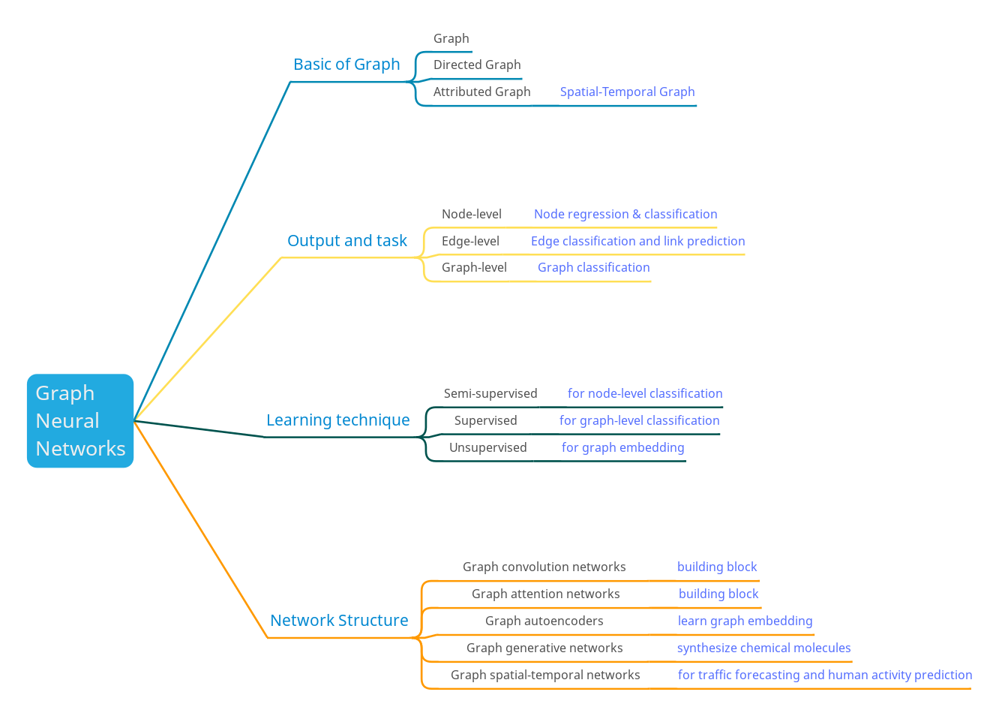
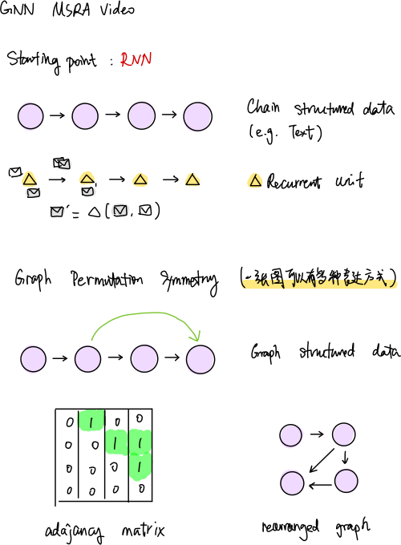
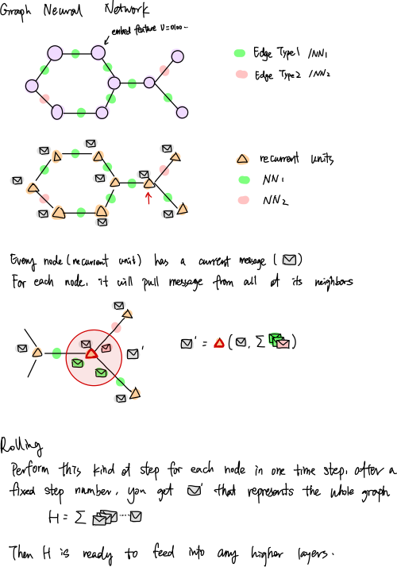

# GNN <!-- omit in toc -->

###### Mon Jul 15 2019

- [What I want to Know](#what-i-want-to-know)
- [1. Survey paper](#1-survey-paper)
  - [Basics of GNN](#basics-of-gnn)
  - [GCN](#gcn)
- [2. MSRA video](#2-msra-video)
- [3. GNN based end-to-end hand reconstruction](#3-gnn-based-end-to-end-hand-reconstruction)

### What I want to Know
- What is GNN?
- How does it work?
- How to use GNN for mesh representation?
- How to use GNN to generate mesh?

### 1. [Survey paper](https://arxiv.org/abs/1901.00596)

#### Basics of GNN

- Graph - Edge has no direction
- Directed Graph - Edge is directed
- Attributed Graph - graph node has features
- Spatial-Temporal Graph - an attribute graph where the feature envolves over time
- Node-level - outputs relate to node regression and classification tasks
- Edge-level - outputs relate to the edge classification and link - prediction tasks
- Graph-level - outputs relate to the graph classification task
- Graph convolution networks - generalize the operation of convolution from traditional data to graph data
- Graph attention networks - GCN with weight, assign a larger weight to the more important nodes, weight is learned with neural network
- Graph autoencoders - unsupervised, learn low dimensional node vectors via an encoder and then reconstruct the graph via a decoder 
- Graph generative networks - aim to generate plausible structures from data
- Graph spatial-temporal networks - aim to learn unseen patterns from spatial-temporal graphs, considers spatial dependency and temporal dependency at the same time

#### GCN
- Spectral-based GCNs
- Spatial-based GCNs
  - RNN based spatial GCN

### 2. [MSRA video](https://www.youtube.com/watch?v=cWIeTMklzNg&t=902s)

_RNN based spatial GCN_

### 3. [GNN based end-to-end hand reconstruction](https://sites.google.com/site/geliuhaontu/home/cvpr2019)

_Spectral-based GCN_

[Notes](https://github.com/reyuwei/awesome-hand-pose-estimation#3d-hand-shape-and-pose-estimation-from-a-single-rgb-image-pdf-project-code-oral)
