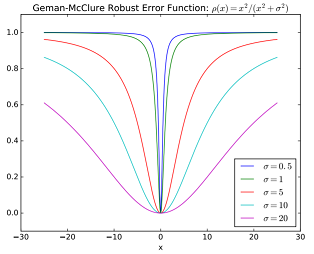

# MANO alignment <!-- omit in toc -->

###### Wed Jul 31 14:37:46 CST 2019

- [What I want to know](#what-i-want-to-know)
- [reference](#reference)
- [BlendSCAPE (Coregistration)](#blendscape-coregistration)
  - [What](#what)
    - [Contributions](#contributions)
    - [Novelty](#novelty)
  - [How](#how)
    - [Deformation of template](#deformation-of-template)
    - [Optimization](#optimization)
- [SMPL](#smpl)
  - [Existing solutions and their problem](#existing-solutions-and-their-problem)
  - [Their solution](#their-solution)
  - [Key Novelty](#key-novelty)
  - [How](#how-1)
    - [Basic skinning function](#basic-skinning-function)
    - [Modification](#modification)
- [MANO](#mano)
  - [Contributions](#contributions-1)
  - [Difference with SMPL](#difference-with-smpl)

## What I want to know
-  How to register a MANO model to target point cloud and/or 3D skeleton?
   -  Given $\theta$ and $\beta$, I need to know the **explicit formula** of mesh points and joint positions.

## reference

[Coregistration: Simultaneous Alignment and Modeling of Articulated 3D Shape](http://link.springer.com/10.1007/978-3-642-33783-3_18)

[SMPL: A Skinned Multi-person Linear Model](http://doi.acm.org/10.1145/2816795.2818013)

[Embodied hands: modeling and capturing hands and bodies together](https://dl.acm.org/citation.cfm?doid=3130800.3130883)


## BlendSCAPE (Coregistration)
*MPI ECCV 2012*

### What
#### Contributions
- A new human parametric model: BlendSCAPE
  - Based on [SCAPE](http://graphics.stanford.edu/courses/cs468-05-fall/Papers/p408-anguelov.pdf), they introduce BlendSCAPE. SCAPE uses a partition of the template triangles into rigid parts for pose deformation, each part in SCAPE is independently rotated, so the final stitched body surface may suffer from collapse, crease or fold near joints. BlendSCAPE use a **linear blend** of part rotations. Weights are defined manually by smoothing SCAPE segmentation across part boundaries. 
- A new method to learn such model
  - **A**: Constructing a human model of deformation
  - **B**: Register to 3D human scans
  - A need B to learn deformation rules
  - B need A to regularize implausible deformations
  - This is a chicken-egg problem.
  - This paper address this problem by **approaching modeling and registration together**.

#### Novelty
- integrate the learning of human model with registration process.
  - the ability to leverage good data to explain poor or missing data
  - the consistency of each individual's shape and poses
  - similarities in the deformations of different bodies as they change pose
  - the presence of ambiguities in pairwise alignment that can be resolved by modeling a class of objects

### How

#### Deformation of template
- Decompose the template $T'$ into disconnected triangles $T'_f$
- Pose deformation with pose vector $\theta$: $B_f(\theta) \overset{def}{=} \sum_i w_{fi}R^i$, $i$ represents human part
- Shape deformation $D_f$
- Non-rigid pose-dependent shape deformation $Q_f(\theta)$, like muscle bulging and skin wrinkling
- Recompose the transformed triangles to define a BlendSCAPE body $M(\theta, D, Q)$


#### Optimization
**Solve for both the alignment and the model parameters!**

- Steps
  - Deform a template to align with scan with per triangle transformation
  - Deform a model to align with template with $\theta, D, Q$
  - Solve the following optimization problem
    - Freeze some parameters and solve the subproblems using MATLAB's ```lsqnonlin```

- Formulation

$min_{\{T^k\},\{\theta^k\},\{D^p\}, Q}\sum_{scans~k}[E_S(T^k;S^k) + \lambda_C(E_C(T^k, \theta^k,D^{p_k},Q)+\lambda_\theta E_\theta(\theta^k))]+\lambda_C[\lambda_D\sum_pE_D(D^p)+\lambda_QE_Q(Q)]$

  - $k$ - $k^{th}$ scan/pose
  - $p$ - $p^{th}$ people
  - $T$ - deformed template surface
  - $S$ - 3D human scan surface
  - $\theta$ - pose for PM model
  - $D$ - shape for PM model
  - $Q$ - non rigid deformation for PM model, pose dependent
  - $E_S(T^k;S^k)$ - data term, evaluates the fit of the deformed template $T$ to the surface of the scan $S$
    - $E_S(T;S) = \frac{1}{a_S}\int_{x_s\in S}\rho(min_{x_t\in T} \left\|x_s-x_t\right\|)$
      - $a_S$ is the scan's surface area
      - $\rho$ is Geman-McClure robust error function, $\rho(x) = \frac{x^2}{\sigma^2 + x^2}$
        
        

  - $E_C(T^k, \theta^k,D^{p_k},Q)$ - coupling term, penalizes differences between the *aligned template* and the *current model*
    - the L2-distance between *pose and scaling only* aligned unstitched triangles and the triangles from fully deformed model M
  - $E_\theta(\theta^k)$ - a weakly informative pose prior, penalized deviation from the template pose, regularizes the pose when the scan provides little useful information
  - $E_D(D^p)$ - regularization term, promotes spatial smoothness of the deformations
  - $E_Q(Q)$ - regularization term, penalizes the magnitude of the effect of the pose-dependent deformation model


## SMPL
*MPI SIGGRAPH 2015*

BlendSCAPE is **triangle based deformation, not compatible with standard graphics pipelines**. In this work, they propose a "Skined Multi-Person Linear" (SMPL) model, which is vertices based deformation. It is compatible with standard graphics software.

### Existing solutions and their problem
- LBS
  - widely used
  - yet well-known unrealistic deformations at joints
- Learned highly realistic body models from data, triangle based
  - lack realism
  - do not work with existing packages
  - do not represent a wide variety of body shapes
  - not compatible with standard graphics pipelines
  - require significant manual labor

### Their solution
- Based on LBS/DQBS
- Learn blend shapes to correct for the limitations 
- Different blend shapes for shape, pose, and soft-tissue dynamics are additively combined with a rest template before blend shinning (LBS/DQBS)
  
### Key Novelty
- They formulate the **pose blend shapes** as **a linear function** of the elements of the part rotation matrices.

### How
#### Basic skinning function

*Basic Skinning for a vertex transformation is **linear combination of part transformations**.*

$\overline{t}_i'=\sum_{k=1}^Kw_{k,i}G'_k(\overrightarrow{\theta},\mathbf{J}) \overline{t}_i$

$G'_k(\overrightarrow{\theta},\mathbf{J})=G_k(\overrightarrow{\theta},\mathbf{J})G_k(\overrightarrow{\theta^*},\mathbf{J})^{-1}$

- $K$ = 23 joints
- $w_{k,i}$ - blend weights
- $\theta$ - pose vector
- $\mathbf{J}$ - a matrix of joint centers
- $\overline{t}_i$ - vertex in rest pose $\mathbf{\overline{T}}$
- $G_k$ - world transformation of joint $k$
- $G'_k(\overrightarrow{\theta},\mathbf{J})$ - joint transformation after removing the transformation due to the rest pose $\overrightarrow{\theta^*}$

#### Modification

*A vertex is first transformed with shape parameters and pose parameters at rest pose, then posed using part rotation.*

$\overline{t_i'}=\sum_{k=1}^Kw_{k,i}G_k'(\overrightarrow{\theta},J(\overrightarrow{\beta};\mathcal{J},\mathbf{\overline{T},\mathcal{S}}))t_P^i(\overrightarrow{\beta},\overrightarrow{\theta};\mathbf{\overline{T}},\mathcal{S}, \mathcal{P})$

<!-- $t_P^i(\overrightarrow{\beta},\overrightarrow{\theta};\mathbf{\overline{T}},\mathcal{S}, \mathcal{P})=\overline{t}_i+\sum_{m=1}^{|\overline{\beta}|}\beta_m\mathbf{s}_{m,i}+\sum_{n=1}^{9K}(R_n(\overrightarrow{\theta)}-R_n(\overrightarrow{\theta}^*))\mathbf{p}_{n,i}$ -->

$t_P^i(\overrightarrow{\beta},\overrightarrow{\theta};\mathbf{\overline{T}},\mathcal{S}, \mathcal{P})=\overline{t}_i+B_s(\overrightarrow{\beta};\mathcal{S})+B_P(\overrightarrow{\theta};\mathcal{P})$

joint position at rest pose: $J(\overrightarrow{\beta};\mathcal{J},\mathbf{\overline{T},\mathcal{S}})=\mathcal{J}\mathbf(\overline{T}+B_s(\overrightarrow{\beta};\mathcal{S}))$

 shape blend shape: $B_s(\overrightarrow{\beta};\mathcal{S})=\sum_{n=1}^{\vert\overline{\beta}\vert}\beta_n\mathbf{s}_{n}$

 pose blend shape: $B_P(\overrightarrow{\theta};\mathcal{P})=\sum_{n=1}^{9K}(R_n(\overrightarrow{\theta)}-R_n(\overrightarrow{\theta}^*))\mathbf{p}_{n}$


- $w_{k,i}$ - blend weights
- $\mathcal{J}$ - a learned matrix that transforms rest vertices into rest joints
- $\mathcal{S}$ - shape blend shape learned parameters
- $\mathcal{P}$ - pose blend shape learned parameters
- $R_n(\overrightarrow{\theta}^*)$ - $n_{th}$ vector in the rest pose rotation matrix

notes: $\mathcal{J}$ is similar to what I want, except that I want joint position after posing instead of rest pose.

## MANO

### Contributions
- Collect a database of detailed hand scans of 31 subjects in up to 51 poses
- Use the data to build a statistical hand model similar to the SMPL body model
- Tracking hands and bodies together [SMPL+H]

### Difference with SMPL
- they encourage the corrective pose blend shapes ($B_P$) to be **local** by penalizing the dependency of corrections on joints which are far away in geodesic terms
- **reduce the dimensionality of the pose space** by computing a linear embedding of the parameters from the dataset


