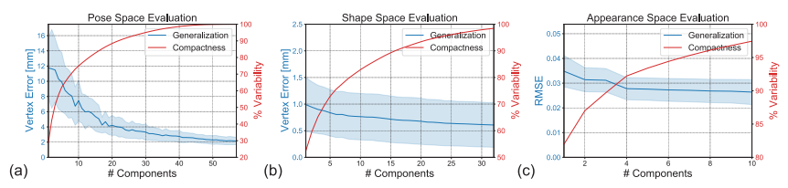

# [SIGGRAPH 2022] NIMBLE: 手部骨骼和肌肉参数模型

你是否希望在虚拟世界中看到准确和逼真的手部运动？今天我们从解剖学的角度来提供一个虚拟手建模的解决方案。

在真实世界中，我们的手有骨骼、肌肉、肌腱等多个解剖学结构。然而传统的手部模型只专注于外表面皮肤建模，骨架结构也是由简单的关节点连线构成。这样的建模方法并不能重现逼真的虚拟手。
在本文中，我们提出了一个全新的参数化手部模型，模型包含骨骼、肌肉、皮肤和外表面贴图，我们称之为**NIMBLE**。

项目主页：https://reyuwei.github.io/proj/nimble

## 数据集
要实现这样的解剖学建模，就一定要有对应的医疗数据。考虑到核共振（MRI）在临床上经常被用来诊断和治疗手部疾病，我们使用临床3T核磁设备采集了高质量的MRI手部三维影像数据集。该数据集包括35个对象的共200个核磁图像，共覆盖50个不同的手部动作。为了准确地区分骨骼、肌肉和皮肤，我们在原始MRI图像上也做了标注。

MRI数据地址：https://github.com/reyuwei/PIANO_mri_data

除了MRI数据，我们还用光场设备采集了高质量手部diffuse、normal和specular贴图。通过贴图插值，我们也实现了对皮肤颜色和纹理的建模。

## 模型定义
仿照马普所的人体参数模型[SMPL](https://smpl.is.tue.mpg.de/)和手部参数模型[MANO](https://mano.is.tue.mpg.de/)，**NIMBLE**模型也是由模板模型、LBS（linear blend skining）和blend shape构成的。
我们的模板模型分为三部分，分别是骨骼、肌肉和外表面，其中肌肉和外表面模型用四面体建模。

## 算法流程
训练模型的流程分为模型配准（registration）和参数学习（parameter learning）两个部分。
其中模型配准是为了将数据统一成相同的拓扑结构，参数学习是将同拓扑的数据作为目标函数去优化模型的参数。
将pose, shape和appearance参数输入训练好的**NIMBLE**模型，就能够生成非常真实的虚拟手。

为了在模型配准中捕捉到肌肉和皮肤的非刚体形变，我们用四面体模型来建模肌肉和皮肤。与三角面片的模型不同的是，四面体模型能够更方便地计算模型体积，也常应用于非刚体物理仿真。我们在模型配准中就利用了neo-hookean弹性模型。我们将其作为一个物理约束应用于模型配准当中，借此保证了模型形变时体积不变，达到了更准确的配准结果。

下图展示了将模板肌肉配准到MRI分割出的肌肉的结果。注意配准后的肌肉厚度增加，并且排列更加紧密。

从配准误差的直方图可以看出，我们的误差基本在2mm以内。

在参数学习的过程中，由于MRI数据的数量有限，我们还借助了[MANO](https://mano.is.tue.mpg.de/)模型的点云数据来扩充运动空间。通过在多个不同模态的数据集上迭代优化，我们最终构建出了**NIMBLE**模型。与仅基于外表面的传统手部模型相比，**NIMBLE**以数据驱动的方式实现了对手的内外部解剖结构统一建模。此外，模型还可以作为一个网络层应用于深度学习，以进行逼真虚拟手的生成和手势识别等多种任务。

## 实验
我们从pose，shape和appearance三个维度验证了模型的compactness和generalization能力。

从几何建模上，我们和外表面模型[MANO](https://mano.is.tue.mpg.de/)做对比。
(a) **NIMBLE**在变形过程中保留了更多皮肤细节，而MANO的结果过于平滑。
(b)(c) MANO在形变时没有考虑内部结构，因此用简单的方法为它加上内部结构后会出现奇怪的肌肉和骨骼形变以及不真实的皮肤凹陷，而**NIMBLE**保持了解剖学上正确的和物理上合理的变形。

从外表建模的角度，我们和贴图模型[HTML](https://handtracker.mpi-inf.mpg.de/projects/HandTextureModel/)模型进行了对比。

(a)(b)分别是两个模型数据集中的手部纹理贴图，(c)(d)是在两个模型的贴图空间中随机采样的纹理。显然我们的模型能够保留更多细节，并且有发现贴图能更好的还原手背上肌腱凸起的效果。